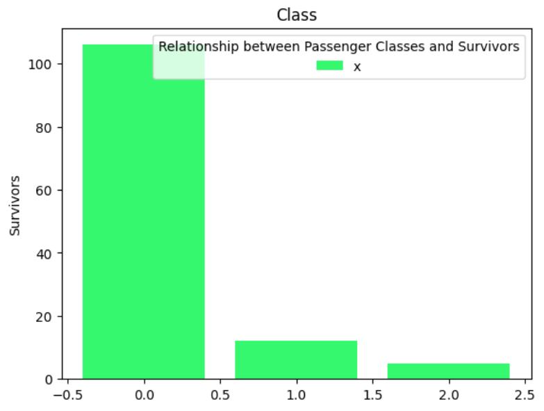
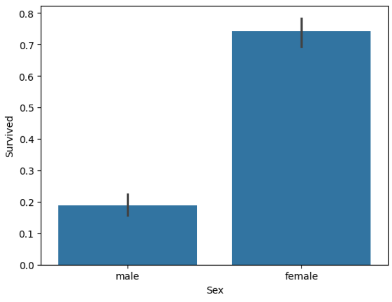
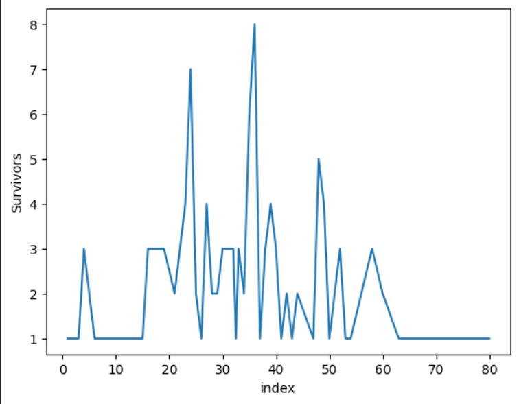
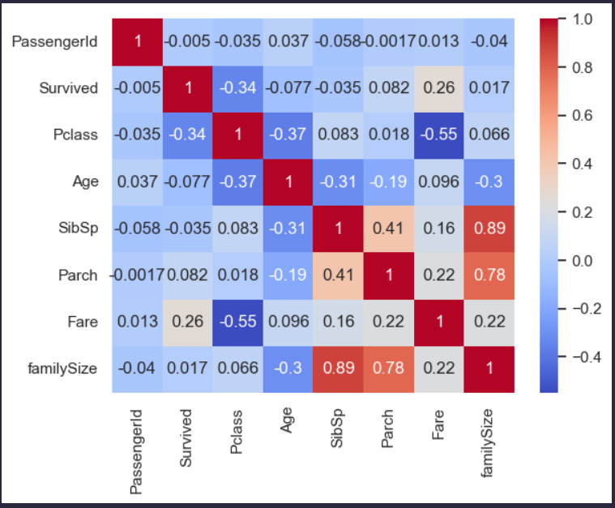

# Exploratory Data Analysis: Titanic Dataset

> A basic analysis of the infamous Titanic Dataset.

## Tooling
- Pandas
- Matplotlib
- Seaborn

## Insights obtained:

- Higher Classes always points to Survival.

- Women had a better chance of Survival, supporting the well known story.

- Young Middle Aged People were the majority among survivors.

- The figure shows a moderate positive linear correlation between parents/children (Parch) and siblings/spouses (SibSp), indicating that family members were travelling together.

- Fare and Passenger Class exhibit a moderate-to-strong negative correlation, which is makes sense since higher classes were more expensive than lower ones.

- Passenger Class and Survival have a negative correlation, suggesting that passengers from wealthier classes had higher chances of survival.

- Age and Passenger Class also show a negative correlation, implying that younger passengers were more likely to be in higher classes.

- A weak negative correlation between SibSp and Age indicates that younger travelers were more often accompanied by their siblings.

- The very weak correlation between Fare and Survival suggests that ticket cost alone had limited impact on survival, supporting the idea that class influenced survival outcomes.

> Women and Children first, Higher Classes first??

---

### This project was done to learn the basic tooling required for machine learning and to become comfortable with python.   

> Open [Jupyter Notebook](titanic.ipynb) to view the analysis